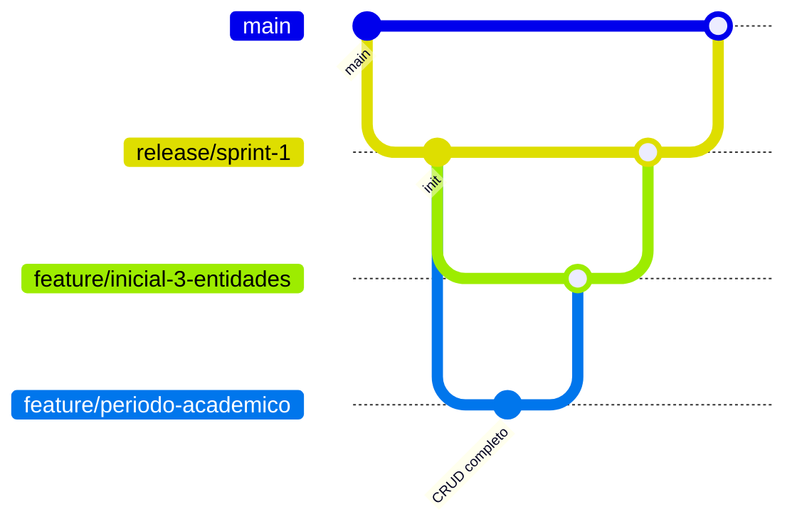

# AcaDigital  
**Sistema de Gestión Academica Institucional**  
**Entrega 1** — CRUD de tres entidades principales  
**Fecha de entrega:** 4 de noviembre – 11:59 p.m.

---

## Objetivo de la entrega
Construir la base del sistema implementando las operaciones **CRUD completas** para tres entidades principales relacionadas con la gestión académica institucional:

- **Programa académico**: información general del programa, nivel educativo, duración y modalidad.  
- **Asignatura**: información sobre las materias impartidas, su carga horaria y tipo (teórica, práctica o mixta).  
- **Período académico**: información del ciclo (nombre, fechas de inicio y fin, estado actual).

---

## Instalacion

```bash
git clone https://github.com/tu-usuario/academia-pro.git
cd academia-pro
npm install
cp .env.example .env
npm run migrate
npm run dev
```

Servidor: http://localhost:3000  
Bruno: `collections/AcaDigital.bruno`

---

## Migraciones

```bash
npm run migrate
```

- `migrations/001-create-programas.sql`
- `migrations/002-create-asignaturas.sql`
- `migrations/003-create-periodos.sql`

**Indices y constraints** para unicidad y rendimiento.

---

## Endpoints (Fastify JSON Schema)

| Entidad        | Método | Ruta                  | Ejemplo de body |
|----------------|--------|-----------------------|-----------------|
| **Programa**   | POST   | `/programas`          | `{ "nombre": "Ing. Sistemas", "nivel": "profesional", "duracion": 10, "modalidad": "presencial" }` |
|                | GET    | `/programas`          | — |
|                | GET    | `/programas/:id`      | — |
|                | PUT    | `/programas/:id`      | — |
|                | DELETE | `/programas/:id`      | — |
| **Asignatura** | POST   | `/asignaturas`        | `{ "nombre": "Cálculo I", "codigo": "CAL-101", "cargaHoraria": 64, "tipo": "teórica", "programaId": "uuid" }` |
|                | GET    | `/asignaturas`        | — |
|                | GET    | `/asignaturas/:id`    | — |
|                | PUT    | `/asignaturas/:id`    | — |
|                | DELETE | `/asignaturas/:id`    | — |
| **Período**    | POST   | `/periodos`           | `{ "nombre": "2025-I", "fechaInicio": "2025-01-15", "fechaFin": "2025-06-30" }` |
|                | GET    | `/periodos`           | — |
|                | GET    | `/periodos/:id`       | — |
|                | PUT    | `/periodos/:id`       | — |
|                | DELETE | `/periodos/:id`       | — |


---

## Validaciones

- Campos **obligatorios**  
- `nombre` único y patrón `^[A-Z0-9-]+$`  
- Fechas ISO  
- `fechaFin > fechaInicio` (validado en controlador)  
- Respuestas estructuradas: `400`, `409`, `404`

**Ejemplo de error:**
```json
{
  "error": "fechaFin debe ser posterior a fechaInicio",
  "field": "fechaFin"
}
```

## Bruno Collection

```
collections/
└── AcaDigital.bruno
```

- 18 requests  
- Incluye errores 400/409


---

## Flujo de ramas




---

## Licencia
MIT © AcademiaPro 2025

---
