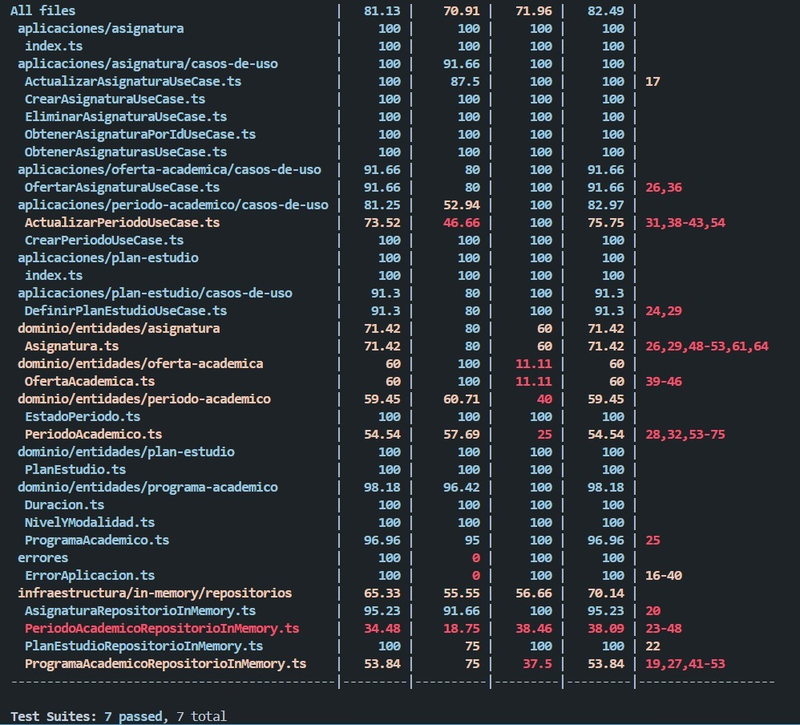
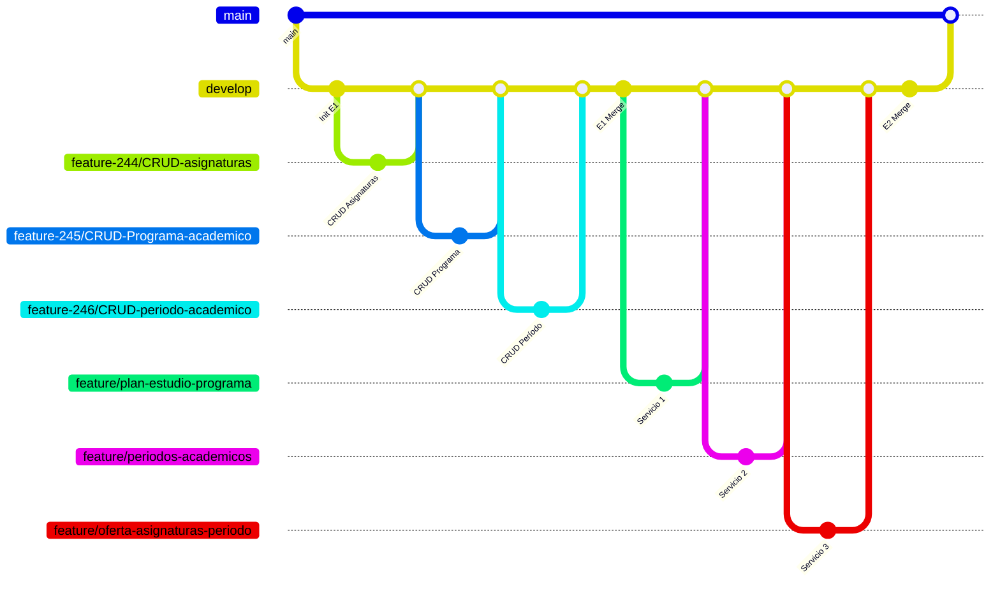

# AcaDigital

**Sistema de Gestión Académica** **Entrega 2** — Servicios de Planificación Académica


-----

## Objetivos del Proyecto

### Entrega 1 — CRUD Base (Completada)

Construir la base del sistema implementando las operaciones **CRUD completas** para tres entidades principales:

  - Programa académico
  - Asignatura
  - Período académico

### Entrega 2 — Servicios de Planificación (Implementada)

Ampliar el sistema con validaciones de negocio complejas y tres servicios transaccionales centrados en la planificación académica:

1.  **Definición de plan de estudio:** Vincular asignaturas a un programa académico (Relación N:M).
2.  **Gestión de períodos:** Implementar la lógica de transición de estados (`activo`, `cerrado`) y validación de no solapamiento de fechas.
3.  **Oferta de asignaturas por período:** Permitir la creación de grupos/secciones con cupos para un período activo.

### Entrega 3 — Mejoras y Pruebas

Optimizar la robustez del sistema mediante mejoras de infraestructura y una estrategia integral de aseguramiento de calidad:

1.  **Infraestructura y Configuración:** Centralización de variables globales y gestión de entorno.
2.  **Manejo de Errores:** Sistema unificado de excepciones para estandarizar la respuesta ante fallos.
3.  **Testing:** Pruebas unitarias y de integración con repositorios en memoria para validar el comportamiento general del sistema.


-----

## Instalacion

```bash
git clone https://github.com/Inexsu-Coordinadora/AcaDigital
cd AcaDigital
npm install
cp .env.example .env
npm run migrate
npm run dev
```

Servidor: http://localhost:3000  

-----

## Migraciones

```bash
npm run migrate
```

  - `migrations/001-create-programas.sql`
  - `migrations/002-create-asignaturas.sql`
  - **`migrations/003-create-periodos.sql`** (Servicio 2)
  - **`migrations/004-create-plan-estudio.sql`** (Servicio 1)
  - **`migrations/005-create-oferta-academica.sql`** (Servicio 3)

**Índices y constraints** para unicidad, coherencia de datos (`CHECK`) e integridad referencial (`ON DELETE CASCADE`).

-----

## Endpoints (API)

#### Documentación Interactiva
- Swagger UI disponible en *http://localhost:3000/docs*
- Generada automáticamente con `@fastify/swagger`
- Cubre todos los endpoints de las 3 entregas

### CRUD Base (Entrega 1)

| Entidad | Método | Ruta (Prefijo: `/api/v1`) | Ejemplo de body |
|---|---|---|---|
| **Programa** | POST | `/programas-academicos` | `{ "nombre": "Ing. Sistemas", "nivel": "Pregrado", "duracionValor": 10, "duracionUnidad": "semestres", ... }` |
| | GET | `/programas-academicos` | — |
| | GET | `/programas-academicos/:id` | — |
| | PUT | `/programas-academicos/:id` | `{ "nombre": "Ing. Actualizada", "descripcion": "..." }` |
| | DELETE | `/programas-academicos/:id` | — |
| **Asignatura** | POST | `/asignaturas` | `{ "nombre": "Cálculo I", "codigo": "CAL-101", "cargaHoraria": 64, "tipo": "teorica" }` |
| | GET | `/asignaturas` | — |
| | GET | `/asignaturas/:id` | — |
| | PUT | `/asignaturas/:id` | `{ "nombre": "Asignatura Actualizada", "cargaHoraria": 80 }` |
| | DELETE | `/asignaturas/:id` | — |
| **Período** | POST | `/periodos` | `{ "nombre": "2025-I", "fechaInicio": "2025-01-15", "fechaFin": "2025-06-30" }` |
| | GET | `/periodos` | — |
| | GET | `/periodos/:id` | — |
| | DELETE | `/periodos/:id` | — |

### Servicios de Planificación (Entrega 2)

| Servicio | Método | Ruta (Prefijo: `/api/v1`) | Ejemplo de body |
|---|---|---|---|
| **1. Plan de Estudio** | POST | `/programas-academicos/:programaId/plan-estudio` | `{ "asignaturaId": 1, "semestreNivel": 1, "creditosCarga": 3 }` |
| **2. Gestión Períodos**| PUT | `/periodos/:id` | `{ "fechaFin": "2025-07-30", "estado": "activo" }` |
| **3. Oferta Académica**| POST | `/ofertas` | `{ "periodoId": "uuid", "programaId": "uuid", "asignaturaId": 1, "grupo": "A1", "cupo": 30 }` |

-----

## Validaciones

El sistema implementa validaciones en la Capa de Presentación (Schema Fastify) y en la Capa de Aplicación (Casos de Uso):

**Validaciones de Forma (Schema):**

  - Campos **obligatorios** (`required`).
  - Tipos de datos (`integer`, `string`, `number`).
  - Coherencia de valores (`minimum: 1` para semestres, `minimum: 0.01` para créditos).

**Validaciones de Negocio (Caso de Uso):**

  - **Unicidad simple:** (ej. `nombre` de asignatura, `nombre` de período).
  - **Existencia (404):** Verifica que `programaId`, `asignaturaId`, etc., existan antes de vincular.
  - **No Duplicidad (409):** Verifica que no se dupliquen vínculos (ej. Asignatura ya vinculada a un programa, o Grupo ya ofertado).
  - **Reglas de Estado:** Verifica que un período esté 'activo' para permitir la oferta de asignaturas (Servicio 3).
  - **Coherencia de Fechas:** `fechaFin > fechaInicio` y validación de no solapamiento de períodos activos (Servicio 2).

**Ejemplo de error (Formato Uniforme):**

```json
{
  "message": "No puede activar un periodo que se solapa con otro periodo activo."
}
```

-----

-----

## Pruebas Automatizadas (Entrega 3)

### Ejecución de Pruebas

Para ejecutar todas las pruebas (unitarias e integración):

```bash
npm test
```

Para generar el reporte de cobertura de código:

```bash
npm test -- --coverage
```



### Resumen de Cobertura

| Tipo                     | Pruebas | Cobertura |
|--------------------------|---------|-----------|
| Unitarias                | 27      | 95–100%   |
| Integración              | 9       | 90%       |
| **Global**               | **36**  | **76.92%**|

-----

## Bruno Collection

La colección de Bruno incluye peticiones para todos los *endpoints* CRUD y los nuevos servicios, incluyendo casos de éxito y error (400, 404, 409).

```
bruno/
└── Peticiones/
    ├── asignatura/
    │   ├── bruno.json
    │   ├── actualizar-asignatura.bru
    │   ├── crear-asignatura.bru
    │   ├── eliminar-asignatura.bru
    │   ├── listar-por-id.bru
    │   └── listar-todos.bru
    ├── oferta-academica/
    │   ├── bruno.json
    │   ├── crear-oferta-exito.bru
    │   ├── crear-oferta-inexistente.bru
    │   ├── error-duplicidad.bru
    │   ├── error-duplicidad-grupo.bru
    │   └── error-periodo-invalido.bru
    ├── periodo-academico/
    │   ├── bruno.json
    │   ├── crear-periodo.bru
    │   ├── actualizar-periodo.bru
    │   ├── eliminar-periodo.bru
    │   ├── listar-periodo-por-id.bru
    │   ├── listar-periodos.bru
    │   ├── error-fecha-invalida.bru
    │   ├── error-solapamiento.bru
    │   └── error-transicion.bru
    ├── plan-estudio/
    │   ├── bruno.json
    │   ├── crear-plan.bru
    │   ├── error-asignatura-no-encontrada.bru
    │   ├── error-duplicidad.bru
    │   ├── error-periodo.bru
    │   └── get-programa-academico.bru
    └── programa-academico/
        ├── bruno.json
        ├── crear-programa-academico.bru
        ├── eliminar programa academico.bru
        ├── listar-por-id.bru
        ├── listar-programas-academicoso.bru
        └── actualizar-programa-academico.bru

```

-----

## Acceso al Azure DevOps

Este proyecto está gestionado en Azure DevOps. Si eres colaborador externo y necesitas acceso para ver tareas, tableros o repositorios, sigue estos pasos:

### Solicitud de acceso

1.  Envía un correo a **apolo4748@gmail.com** con el asunto: `Solicitud de acceso a Azure DevOps - AcaDigital`.
2.  Incluye en el mensaje:
      - Tu nombre completo
      - Correo asociado a tu cuenta Microsoft o GitHub
      - Rol que desempeñarás (ej. revisor, desarrollador, stakeholder)
3.  Una vez aprobado, recibirás una invitación por correo para unirte a la organización.

> El acceso está limitado a cuentas con correo válido y puede requerir una cuenta Microsoft gratuita.

-----

### Enlace al proyecto (requiere acceso)

[https://dev.azure.com/Deilons/AcaDigital - inesxu](https://dev.azure.com/Deilons/AcaDigital%20-%20Inesxu)

-----

## Flujo de ramas

El flujo de trabajo se basa en ramas de *features* (para E1 y E2) que se integran en `develop` antes de pasar a `main`.



  - Ramas de *feature* (ej. `feature/plan-estudio-programa`) se crean desde `develop`.
  - El trabajo se integra en `develop`.
  - `develop` se fusiona con `main` para las entregas estables.

-----

## Licencia

MIT © AcaDigital 2025
